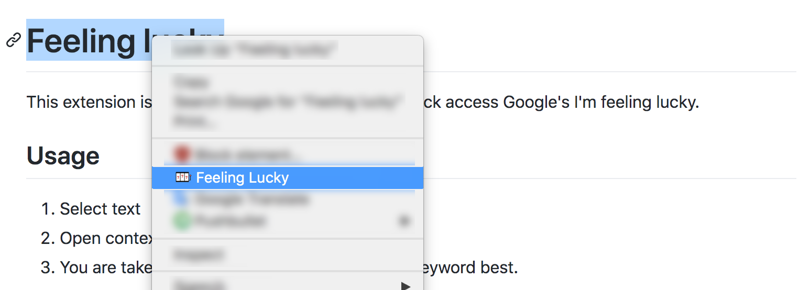

# Feeling lucky

This extension is for the lucky ones. It works as a quick access Google's I'm feeling lucky.

## Usage

1. Select text
2. Open context menu and click `Feeling lucky`
3. You are taken to the website that matches the keyword best.

### Auto redirect

If you are taken to domains other than `google.com`, e.g. `google.com.hk`, before hitting your lucky result. You can activate this extension on that domain to enable auto-skip in the future.

## Install

